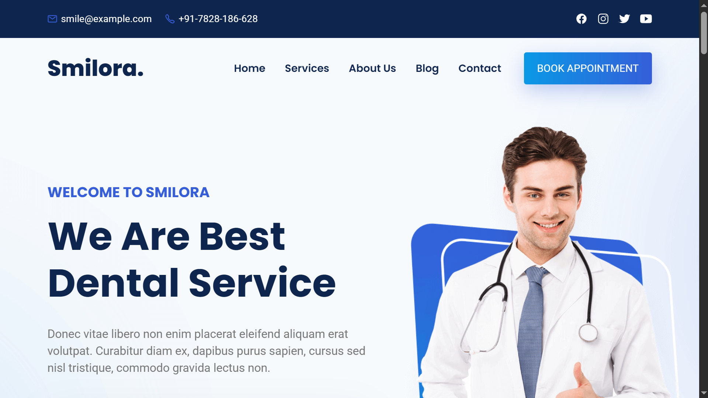
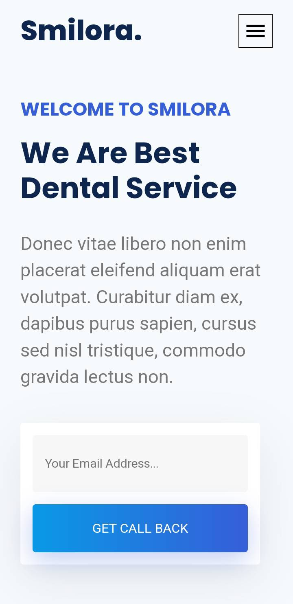

<div align="center">

<br />
<br />

<h2 align="center">Smilora - Your Smile, Our Priority</h2>

Smilora is a modern and fully responsive dental website designed to provide essential information about dental services, team, and booking appointments. Built with HTML, CSS, and JavaScript for seamless performance across all devices.

<!-- Live demo link opens in new tab -->

<a href="https://smilora.netlify.app/" target="_blank" rel="noopener noreferrer"><strong>➥ Live Demo</strong></a>

</div>

---

## Table of Contents

- [About Smilora](#about-smilora)
- [Features](#features)
- [Screenshots](#screenshots)
- [Getting Started](#getting-started)
- [Contact](#contact)
- [License & Credits](#license--credits)
- [My Purpose](#my-purpose)

---

## About Smilora

Smilora aims to make dental care accessible and informative. Visitors can explore services like root canal treatment, cosmetic dentistry, oral hygiene guidance, and book appointments easily. The website highlights the expert team of dentists, latest blog updates, and provides a professional interface for patients.

---

## Features

- Fully responsive layout for desktop, tablet, and mobile
- Hero section with welcoming message and call-to-action
- Comprehensive Services section with detailed descriptions
- About section emphasizing dental care commitment
- Team section showcasing expert dentists with social media links
- Blog section to keep patients updated
- Contact section with email, phone, and location
- Book appointment call-to-action button
- Smooth scrolling and back-to-top functionality

---

## My Purpose

This project, **Smilora**, was created purely for learning purposes to improve my front-end web development skills using HTML, CSS, and JavaScript.

I was inspired by an existing GitHub project called [Dentelo](https://github.com/example/dentelo) and carefully studied it to understand its structure and design. Using that knowledge, I recreated a similar website called Smilora to practice and enhance my skills.  
This project is for personal learning and portfolio purposes only.

---

## Screenshots

  


---

## Getting Started

To run Smilora locally, follow these steps:

1. Clone the repository:

```bash
git clone https://github.com/malviyanayan/smilora.git
```
